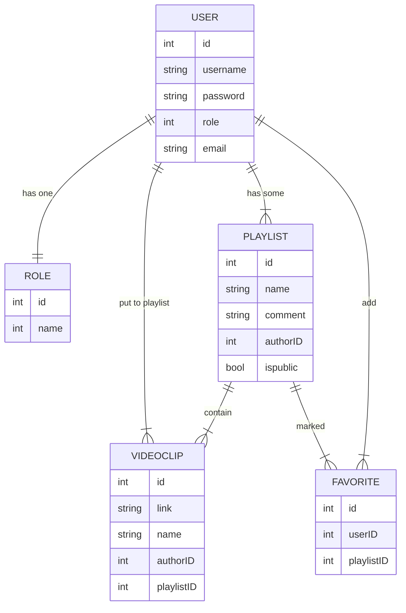

# VideoClips

Веб-сервис сохранения ссылок на понравившиеся фрагменты из видео (YouTube)

## how to run the app

- run `scripts\server.ps1`

- powershell run:

```sh
$env:FLASK_APP="webapp"; $env:FLASK_ENV="development"; $env:FLASK_DEBUG=1; flask run
```

- cmd run:

```sh
set FLASK_APP=webapp&& set FLASK_ENV=development && set FLASK_DEBUG=1 && flask run
```

## another actions

- script/bootstrap - installs/updates all dependencies
- script/update - updates a project to run at its current version
- script/server - starts app

## database scheme 2021-07-11


